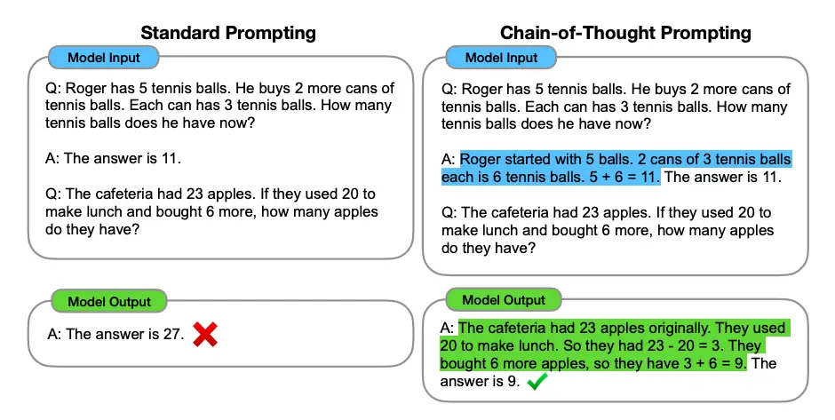
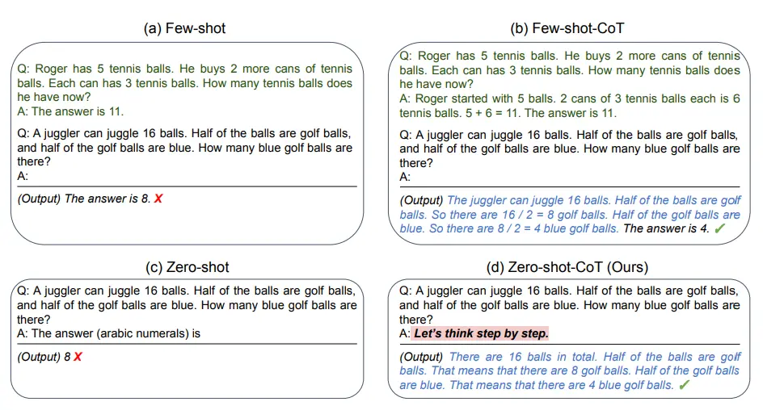
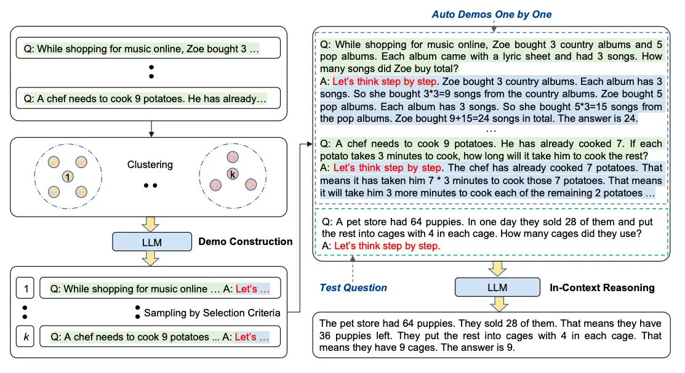

### 🔥🔥🔥**Chain-of-Thought (CoT) Prompting**
```
🔹"Chain-of-Thought (CoT)" prompting is a technique introduced by Wei et al. (2022) that improves a model’s ability to solve complex problems by showing intermediate reasoning steps before giving the final answer.  

🔹 Instead of asking the model for only the final result, CoT encourages the model to "think step-by-step". 
 
🔹 CoT prompting is widely used today for advanced reasoning tasks and forms the foundation of many modern prompt engineering techniques.
```

#### **Core Idea**
```
🔹 Traditional prompting → Model gives a direct answer.  
🔹 CoT prompting → Model explains the reasoning process first, then gives the answer.  

🔹 This approach works especially well for:
    - Mathematical problems  
    - Logical reasoning  
    - Multi-step decision making  
    - Commonsense reasoning tasks  

🔹 Even "one reasoning example" (1-shot CoT) can significantly improve performance.  
🔹 The model learns *how to think*, not just *what answer to give*. 

```

#### 🔥**How CoT Works**
```
🔹 CoT is usually combined with "few-shot prompting".  
🔹 Example demonstrations include:
    - The question  
    - Step-by-step reasoning  
    - Final conclusion  

🔹 The model learns to imitate this reasoning pattern for new problems.

    Instead of: Question → Answer
    CoT uses:   Question → Reasoning Steps → Final Answer

🔹 Example reasoning:   Add odd numbers → Calculate sum → Check condition → Give answer
🔹 When reasoning steps were included, the model produced the correct solution consistently.
```
<p align="center">

</p>

#### **Simple Understanding**
```
🔹 Zero-shot → Give instruction only.  
🔹 Few-shot → Give examples.  
🔹 Chain-of-Thought → Give examples "with reasoning steps".
```

---


### 🔥🔥🔥**Zero-Shot Chain-of-Thought (Zero-Shot CoT) Prompting**
```
🔹 "Zero-shot Chain-of-Thought (CoT) prompting" is a technique introduced by Kojima et al. (2022).  

🔹 It improves reasoning performance "without providing examples" by simply encouraging the model to reason step-by-step.  

🔹 The method works by adding a short instruction such as: 👉 "Let's think step by step."
```

#### 🔥**Core Idea**
```
🔹 Standard zero-shot prompting asks for a direct answer.  
🔹 Zero-shot CoT tells the model to "show its reasoning process first", even when no demonstrations are given.  
🔹 This activates the model’s internal reasoning abilities learned during training.
```

#### 🔥**Example Without Zero-Shot CoT**

*Prompt*
```
    I went to the market and bought 10 apples.
    I gave 2 apples to the neighbor and 2 to the repairman.
    I then bought 5 more apples and ate 1.
    How many apples remain?
```
*Output*
```
    11 apples (Incorrect)

🔹 The model rushed to an answer without reasoning.
```

#### 🔥**Example With Zero-Shot CoT**
*Prompt*
```
    I went to the market and bought 10 apples.
    I gave 2 apples to the neighbor and 2 to the repairman.
    I then bought 5 more apples and ate 1.
    How many apples remain?
    Let's think step by step.
```
*Output Reasoning*
```
    Start with 10 apples.
    Give away 4 apples → 6 left.
    Buy 5 more → 11 apples.
    Eat 1 → 10 apples remain.

    Final Answer: 10 apples 
```
<p align="center">

</p>

#### 🔥**Note**
```
🔹 A simple reasoning instruction can dramatically improve performance.
🔹 Zero-shot CoT shows that prompting style alone can unlock advanced reasoning abilities in large language models.
```

----

### 🔥🔥🔥**Auto Chain-of-Thought (Auto-CoT)**
```
🔹 "Auto-CoT" is an advanced prompting technique proposed by Zhang et al. (2022) to automate the creation of Chain-of-Thought (CoT) demonstrations.  

🔹 Traditional CoT prompting requires humans to manually write reasoning examples, which can be time-consuming and sometimes ineffective.  

🔹 Auto-CoT removes much of this manual work by using LLMs themselves to automatically generate reasoning examples.
```
#### 🔥**Problem with Manual CoT**
```
🔹 Hand-crafted demonstrations require effort and expertise.  
🔹 Poorly designed examples can lead to weak model performance.  
🔹 Human-created reasoning chains may not cover enough task diversity.  
```

#### 🔥**Core Idea of Auto-CoT**
```
🔹 Automatically generate reasoning demonstrations instead of manually writing them.  
🔹 Use "Zero-Shot CoT prompting" (e.g., "Let's think step by step") to produce reasoning chains.  
🔹 Improve reliability by ensuring demonstrations are diverse.
```

<p align="center">

</p>

#### 🔥**Auto-CoT Workflow**

**Stage 1: Question Clustering**
```
🔹 Questions from a dataset are grouped into several clusters.  
🔹 Each cluster represents a different type or pattern of problem.  
🔹 This ensures coverage of multiple reasoning styles.
```

**Stage 2: Demonstration Sampling**
```
🔹 One representative question is selected from each cluster.  
🔹 The model generates reasoning chains using Zero-Shot CoT.  
🔹 These generated examples become few-shot demonstrations.
```
**🔥 Heuristics Used**
```
🔹 Simple rules help maintain quality, such as:
        - Limiting question length (e.g., ~60 tokens)  
        - Restricting reasoning steps (e.g., ~5 steps)  

🔹 These constraints encourage clearer and more accurate demonstrations.
```

#### 🔥**Simple Understanding**
```
🔹 Manual CoT → Humans write reasoning examples.  
🔹 Zero-Shot CoT → Add reasoning instruction only.  
🔹 Auto-CoT → Model automatically creates reasoning examples for itself.
```