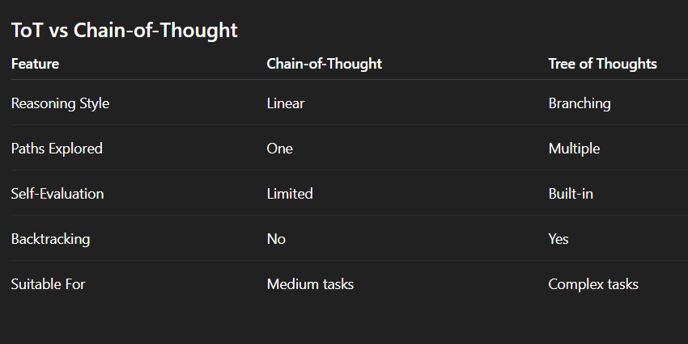

### 🔥🔥🔥**Tree of Thoughts (ToT)**
```
Tree of Thoughts (ToT) is an advanced prompting and reasoning framework proposed by Yao et al. (2023) and Long (2023) to help Large Language Models (LLMs) solve complex problems.

Traditional prompting methods often fail when tasks require:
        exploration
        planning
        strategy
        lookahead reasoning

ToT extends Chain-of-Thought (CoT) by allowing the model to explore multiple reasoning paths instead of following only one.
```
#### 🔥**Core Idea**
```
Instead of thinking linearly, the model thinks like a decision tree.

Chain-of-Thought (CoT) :
Problem → Thought 1 → Thought 2 → Final Answer

Tree of Thoughts (ToT) :

               Problem
              /   |   \
        Thought A Thought B Thought C
           /            \
     Next Thoughts     Next Thoughts

👉 The model explores many possible reasoning routes before choosing the best solution.
```

#### 🔥**What is a "Thought"?**
```
A thought is:
    a coherent reasoning step
    a partial solution
    an intermediate idea toward solving the problem

Example (Math task):
    Thought 1 → Try addition
    Thought 2 → Try multiplication
    Thought 3 → Try subtraction

Each thought becomes a branch in the tree.
```

#### 🔥**Key Components of ToT**

***1. Thought Generation***
```
The LLM generates multiple candidate reasoning steps.

Example:
        Candidate 1
        Candidate 2
        Candidate 3
        Candidate 4
        Candidate 5
```
***2. Thought Evaluation (Self-Evaluation)***
```
The model evaluates each thought using labels such as:
    ✅ Sure → likely leads to solution
    🤔 Maybe → uncertain but possible
    ❌ Impossible → cannot reach solution

This enables self-reflection.
```

***3. Tree Structure***
```
The reasoning process forms a tree:
    Nodes → thoughts
    Branches → reasoning options
    Paths → possible solutions
```
***4. Search Algorithms***
```
ToT combines LLM reasoning with classical search algorithms:
    Breadth-First Search (BFS)
    Explores many thoughts at the same level.
    Promotes diverse exploration.
    Depth-First Search (DFS)
    Explores one reasoning path deeply.
    Useful for focused problem solving.
```

***5. Lookahead & Backtracking***
```
Unlike CoT:
    The model can look ahead
    Detect bad reasoning early
    Backtrack and try another path

Example: Game of 24
Task : Given numbers → create equations that result in 24.

Step Design: The problem is broken into:
            3 reasoning steps
            Each step produces an intermediate equation.
``` 


#### 🔥**Difference between CoT & ToT**
<p align="center">

</p>


#### 🔥**When to Use ToT**
```
Use Tree of Thoughts when tasks require:
        strategic planning
        exploration
        logical search
        multi-step reasoning
        decision making

Examples:
        Game solving
        Mathematical proofs
        Coding design
        Research reasoning
        Planning systems
``` 