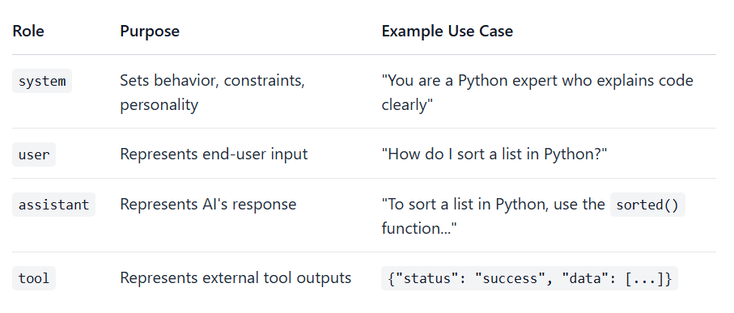

### 🔥🔥🔥**What is chatML Prompting?**
```
ChatML (Chat Markup Language) is a structured, role-based format designed to help AI models clearly distinguish between different parts of a conversation. It is widely used by many open-source models (like the Qwen family) and was originally introduced by OpenAI. 
```
#### 🔥**How ChatML Works?**
```
The format wraps every message in specific "special tokens" to define where a turn begins and ends, and who is speaking

<|im_start|>  — Marks the beginning of a message
<|im_end|>    — Marks the end of a message
```
***1. Core Structure***
```
A standard ChatML message follows this template:
    <|im_start|>{role}
    {content}
    <|im_end|>

    <|im_start|>:    Marks the beginning of a message.
    {role}:          Specifies who is speaking (system, user, or assistant).
    {content}:       The actual text of the message.
    <|im_end|>:      Marks the end of that specific message
```

***2. Standard Roles***
<p align="center">

</p>

#### 🔥**The Evolution of Prompt Engineering**

*Before ChatML:*
```py
# Unstructured, fragile prompts
prompt = """
System: You are helpful.
User: Hello
AI: Hi there!
User: What's the weather?
"""
```
*With ChatML*
```py
<|im_start|>system
You are helpful.
<|im_end|>
<|im_start|>user
Hello
<|im_end|>
<|im_start|>assistant
Hi there!
<|im_end|>
<|im_start|>user
What's the weather?
<|im_end|>
<|im_start|>assistant
```